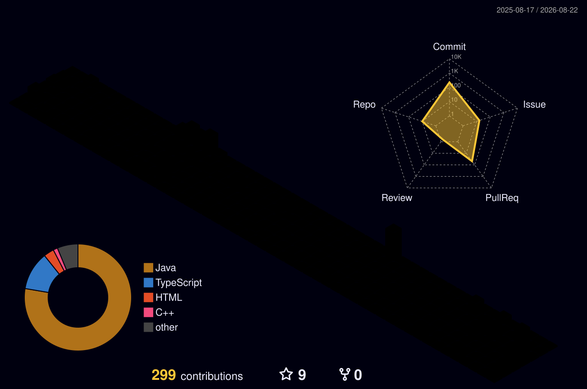

<!-- ============================ ANIMATED HEADER ============================ -->

  

<!-- ============================ TYPING ANIMATION ============================ -->

  

  

 

<!-- ============================ ABOUT ============================ -->
# :octocat: About Me:

Hi there! I'm **Kristian** 🎓
- 🏫 I graduated from [Baba Tonka Mathematics High School](http://www.mg-babatonka.bg/) in Ruse, Bulgaria.
- 📚 Currently studying at [Technical University of Würzburg-Schweinfurt (THWS)](https://www.thws.de/).
- 🔍 Looking for an **internship** 🤝.
- 💼 I work day to day in **Java, Spring Boot & microservices** — REST APIs, Hibernate/JPA, MySQL, Docker.
- 🚀 Passionate about **backend development**, **system programming**, and **low-level programming**.
- 🌱 Currently exploring **C, Assembly, Racket** and 3D graphics with **Three.js**.
- 🌍 Bulgarian 🇧🇬, studying in Germany 🇩🇪 — I speak Bulgarian, English and German.

 

<!-- ============================ PROJECTS ============================ -->
<!-- TODO: paste the repo URL into each [] below, delete any project that
     isn't public yet. This is the section recruiters actually read. -->
# 🛠️ What I'm Building:

### ☕ Java / Spring Boot

| Project | What it is | Stack |
| :--- | :--- | :--- |
| **[Car Service](https://github.com/PhoenixMaster123/car-service)** | Service-management platform for a real auto business — Thymeleaf UI plus REST API, talking to separate booking and payment microservices, with OAuth2 login. | `Java 17` `Spring Boot 3.4` `Spring Cloud` `MySQL` |
| **[Library Management System](https://github.com/PhoenixMaster123/library-management-system)** | Catalogue, lending and returns backend built on **Hexagonal Architecture**, with HATEOAS links, HTTP caching and a JUnit suite. | `Java 21` `Spring Boot` `Spring Security` `JPA` |
| **[Patient Management System](https://github.com/PhoenixMaster123/Patient-Management-System)** | Patient Management System built using Microservices Architecture with Spring Boot and AWS | `Java` `Spring Boot` `AWS`|

### 🎨 Other Work

| Project | What it is | Stack |
| :--- | :--- | :--- |
| **[Автокомплекс Харис](https://github.com/PhoenixMaster123/haris-auto)** | The customer-facing site for the same auto business — four-language i18n, before/after slider, Sofia Sans typography. | `React` `TypeScript` `Vite` |
| **[E-Commerce-Webshop](https://github.com/PhoenixMaster123/E-Commerce-Webshop)** | <!-- paste repo URL above --> E-Commerce-Webshop | `TypeScript` `Vite` |

 

<!-- ============================ CONNECT ============================ -->
## 🌐 Connect with Me:

 

<!-- ============================ TECH STACK ============================ -->
# 💻 Tech Stack:

**Backend**

**Systems & Low-Level**

**Frontend**

**Tooling**

 

<!-- ============================ STATS ============================ -->
<!-- The old cards here (github-readme-stats / streak / trophy) are removed on
     purpose: those public services are rate-limited or returning 402, so they
     rendered as broken images. Once metrics.yml has run once and the metrics/
     folder exists on main, delete the two comment markers below. -->
<!--
# 📊 Stats:

## 🏆 Achievements:

-->

<!-- ============================ ARCADE ============================ -->
## 🕹️ Arcade Mode:

<picture>
  <source media="(prefers-color-scheme: dark)" srcset="https://raw.githubusercontent.com/PhoenixMaster123/PhoenixMaster123/output/snake-dark.svg?v=1" />
  <source media="(prefers-color-scheme: light)" srcset="https://raw.githubusercontent.com/PhoenixMaster123/PhoenixMaster123/output/snake.svg?v=1" />
  
</picture>

<b>👾 Insert coin — 3 more games</b>

 

<picture>
  <source media="(prefers-color-scheme: dark)" srcset="https://raw.githubusercontent.com/PhoenixMaster123/PhoenixMaster123/output/pacman-contribution-graph-dark.svg" />
  <source media="(prefers-color-scheme: light)" srcset="https://raw.githubusercontent.com/PhoenixMaster123/PhoenixMaster123/output/pacman-contribution-graph.svg" />
  
</picture>

<picture>
  <source media="(prefers-color-scheme: dark)" srcset="https://raw.githubusercontent.com/PhoenixMaster123/PhoenixMaster123/output/breakout-contribution-graph-dark.svg" />
  <source media="(prefers-color-scheme: light)" srcset="https://raw.githubusercontent.com/PhoenixMaster123/PhoenixMaster123/output/breakout-contribution-graph.svg" />
  
</picture>

<picture>
  <source media="(prefers-color-scheme: dark)" srcset="https://raw.githubusercontent.com/PhoenixMaster123/PhoenixMaster123/output/galaga-contribution-graph-dark.svg" />
  <source media="(prefers-color-scheme: light)" srcset="https://raw.githubusercontent.com/PhoenixMaster123/PhoenixMaster123/output/galaga-contribution-graph.svg" />
  
</picture>

 

<!-- ============================ 3D CALENDAR ============================ -->
## 🧊 My Year Contribution:

<!-- ============================ ANIMATED FOOTER ============================ -->

  

